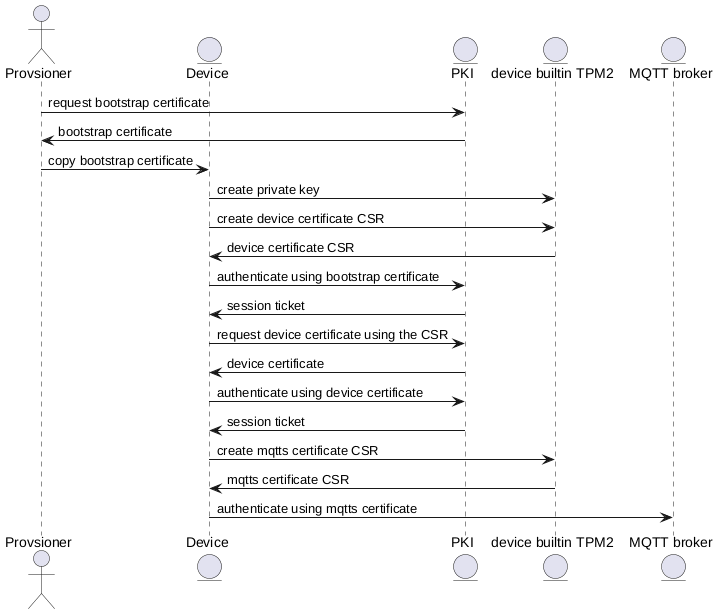

# TPM 2.0 Device Certificate Demo

Demonstrates how to use TPM 2.0 for IoT device enrollment.

## Requirements

### Packages

- qemu-kvm
- libvirt-daemon-system
- virtinst
- libvirt-clients
- wget

### Permissions (Groups)

- libvirt
- kvm

## Description

### Enrollment Flow

1. Create an initial, short-lived bootstrap certificate.
2. Copy the bootstrap certificate into the device.
3. Generate a new TPM 2.0–backed private key inside the device.
4. Create a CSR using the TPM-backed private key.
5. Authenticate the device with the PKI using the bootstrap certificate.
6. Submit the CSR to the PKI.
7. Store the returned long-lived device certificate on the device.
8. Use the device certificate to authenticate with the PKI.
9. Request a new MQTT client certificate.



## Usage

Run:

```bash
./main.sh
```

This will create and start:
- PKI certificates
- Bootstrap certificate
- PKI (OpenBao)
- MQTT broker (Mosquitto)
- TPM 2.0–backed Debian GNU/Linux VM